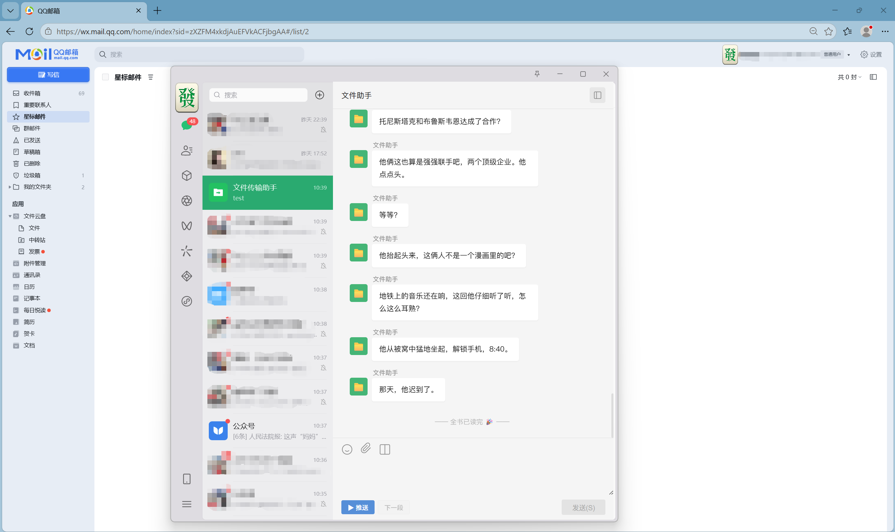
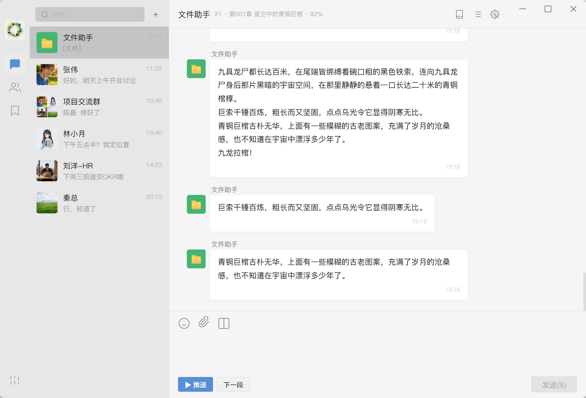
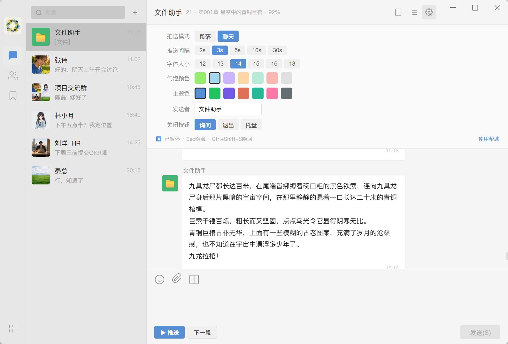

# ChatNovel

> 在办公室、图书馆、任何不方便看小说的场景中，把阅读伪装成聊天。

ChatNovel 不是阅读器，而是一种「**隐身阅读方式**」。它将 TXT 小说伪装成聊天消息，以气泡形式定时推送——旁人看到的只是你在回消息。



> 上图：浏览器开着 QQ 邮箱（认真工作的样子），真微信浮在上面（回消息的样子），ChatNovel 极简模式覆盖在最上方——左边的"文件传输助手"是真微信，右边的"文件助手"是 ChatNovel。

## 使用场景

- 🏢 上班摸鱼但不想被发现
- 📚 图书馆、自习室低调阅读
- 💻 不方便打开阅读器的软件环境

## ⚡ v1.2.0 新增：极简模式

一键开启「极简模式」，ChatNovel 会自动：

- 隐藏自身的所有 UI 特征（联系人侧栏、副标题、推送按钮、窗口控制按钮）
- 关闭系统窗口阴影（避免悬浮时一圈灰边暴露轮廓）
- 缩小窗口到 460×600（可自由拖动调整，**尺寸自动记忆**）
- 失焦时自动暂停推送（切到真微信时不会错过内容）
- 召回时自动退出极简模式（老板键召回 = 一键还原安全界面）

效果：覆盖在真微信的聊天区域上，看起来就像微信的「文件助手」对话——上下两个文件助手并排，几乎没人能分辨哪个是真的。

## 截图

### 伪装界面 — 旁人只看到普通聊天


### 阅读模式 — 小说内容以气泡形式推送


### 设置面板 — 推送模式、间隔、颜色均可自定义


## 特性

### 核心阅读
- TXT 上传，自动识别章节（含 "第一百零X章" 这类中文数字混合格式）
- 段落模式 / 聊天模式（短句 + 随机间隔）
- 推送间隔、每段字数可调
- 章节结束自动进入下一章
- 长按「下一段」连续快速推送
- 书架管理，多本书独立进度
- GBK 编码自动检测
- 支持百万字级别长篇网文
- 消息流按整点/半点显示时间分隔条，模拟真实聊天节奏

### 伪装系统
- **极简模式**（v1.2.0 新增，见上方）
- 默认打开停在普通联系人界面，无任何阅读痕迹
- 左侧预览只显示 `[文件]`，不泄露小说内容
- Esc 一键隐藏到系统托盘（任务栏也消失）
- Ctrl+Shift+S 全局热键从托盘唤回
- 唤回后自动重置到安全界面 + 退出极简模式
- 预设 5 个联系人 + 真实聊天记录

### 自定义
- 气泡颜色、主题色、字体大小
- 发送者名称、头像均可更换
- 自建联系人 + 自定义聊天记录
- 右键联系人删除（含确认对话框）
- 关闭按钮行为可配置
- 输入框高度可拖动调整

## 体积对比

|  | Electron 版 | Tauri 版 |
|---|---|---|
| 安装包 | ~180 MB | **1.9 MB** |
| 内存占用 | ~150 MB | ~30-50 MB |

## 安装

### 方式一：下载安装包（推荐）

从 [Releases](https://github.com/Clarence-Hugc/ChatNovel/releases) 下载最新版 `ChatNovel_x.x.x_x64-setup.exe`，双击安装即可。

### 方式二：从源码构建

需要先安装 [Rust](https://www.rust-lang.org/) 和 [Tauri CLI](https://v2.tauri.app/start/prerequisites/)：

```bash
git clone https://github.com/Clarence-Hugc/ChatNovel.git
cd ChatNovel/src-tauri
cargo tauri build
```

> 本项目前端是单文件 HTML（CDN React），不需要 Node.js / npm。

## 快捷键

| 快捷键 | 功能 |
|---|---|
| `Esc` | 隐藏到系统托盘 |
| `Ctrl+Shift+S` | 从托盘唤回窗口 |
| `Ctrl+Space` | 推送开关 |
| `Ctrl+↓` | 下一段 |
| `Ctrl+→` | 下一章 |

## 技术栈

- 前端：React 18 + Babel（单文件 HTML）
- 桌面封装：Tauri 2（Rust 后端 + 系统 WebView2）
- 书籍存储：本地文件系统（AppData）
- 设置存储：localStorage

## 免责声明

1. 本软件仅供个人学习与合法阅读使用，不得用于任何违法目的。
2. 用户需自行确保所阅读内容不侵犯他人著作权。本软件不提供任何书源或小说内容。
3. 不建议在明确禁止使用此类软件的工作或学习环境中使用。
4. 因使用本软件产生的任何后果由使用者自行承担，开发者不承担任何责任。

## License

[MIT](LICENSE)
